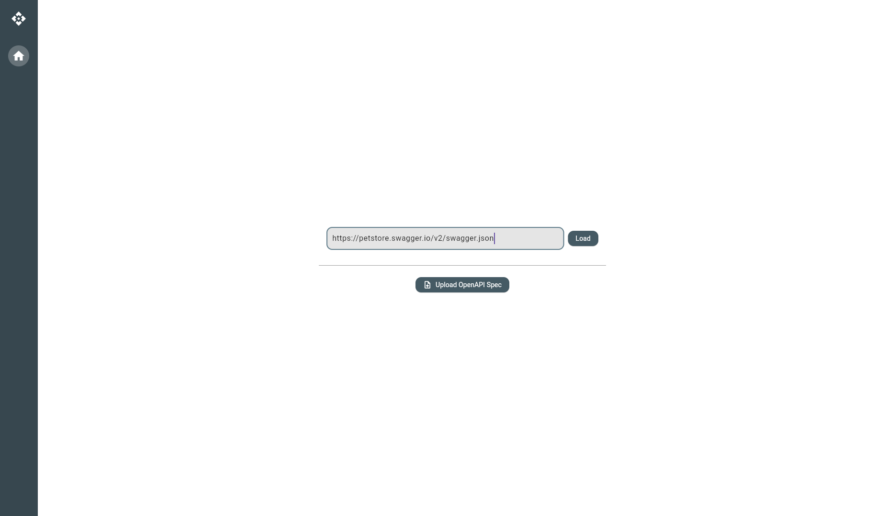
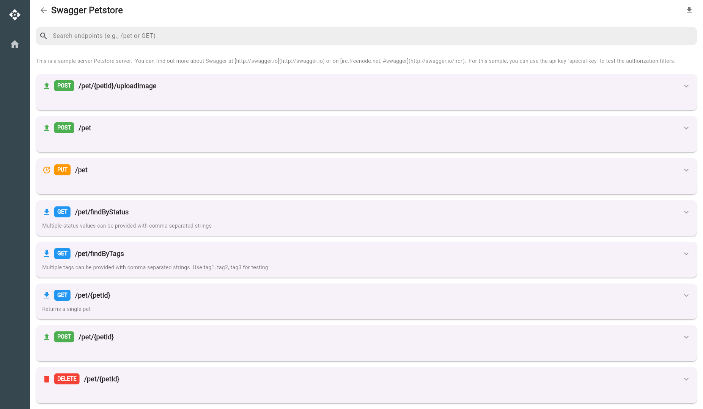
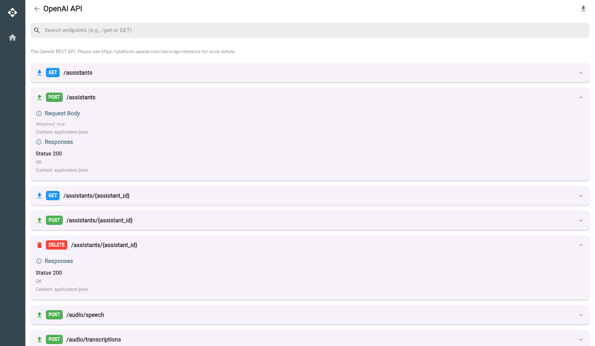

# ApiForge

ApiForge is a Flutter-based application designed to load, parse, and display OpenAPI specifications. It allows users to load OpenAPI specs either by providing a URL or uploading a local file (in JSON or YAML format). The app provides a clean and intuitive interface to view API endpoints, their methods, and descriptions, making it a useful tool for developers working with APIs.

## Features

- **Load OpenAPI Specs**: Load specs from a URL or by uploading a local file (JSON/YAML).
- **View Endpoints**: Display API endpoints with their methods, paths, and descriptions in a user-friendly format.
- **Search Functionality**: Filter endpoints by path or method using a search bar.
- **Export to Postman**: Export the loaded OpenAPI spec as a Postman collection for easy testing.
- **Responsive Design**: Adapts to different screen sizes, including desktop and web browsers.

## Screenshots

### Home Screen


### Spec Screen



### Payloads



## Getting Started

### Prerequisites

- **Flutter**: Ensure you have Flutter installed (version 3.19.0 or later recommended). Follow the [official Flutter installation guide](https://flutter.dev/docs/get-started/install) if needed.
- **Dart**: Comes bundled with Flutter.
- **Git**: To clone the repository.
- **Node.js and npm**: For running a local web server (optional, for testing the web build).

### Installation

1. **Clone the Repository**:
   ```bash
   git clone https://github.com/BalaSubramaniam12007/apiforge_v0.git
   cd apiforge_v0
   ```

2. **Install Dependencies**:
   Run the following command to fetch the required Flutter packages:
   ```bash
   flutter pub get
   ```

### Running the App

#### On Linux (Desktop)
To run the app on a Linux desktop:
```bash
flutter run -d linux
```

#### On Web (Local Development)
To run the app in a web browser locally:
```bash
flutter run -d chrome
```

#### On Web (Local Server)
To build and test the web version using a local server:
1. Build the web app:
   ```bash
   flutter build web --release
   ```
2. Install `http-server` (requires Node.js and npm):
   ```bash
   npm install -g http-server
   ```
3. Start the server:
   ```bash
   cd build/web
   http-server -p 8080
   ```
4. Open `http://localhost:8080` in your browser.

### Usage

1. **Home Screen**:
   - Enter a URL to an OpenAPI spec (e.g., `https://petstore.swagger.io/v2/swagger.json`) in the input field and click "Load".
   - Alternatively, click "Upload OpenAPI Spec" to upload a local `.json` or `.yaml` file.
   - The app will navigate to the `SpecScreen` to display the loaded spec.

2. **Spec Screen**:
   - View the API specification title and description (if available).
   - Use the search bar to filter endpoints by path or method.
   - Browse the list of endpoints, which display the HTTP method, path, and description.
   - Click the download button to export the spec as a Postman collection.

3. **Navigation**:
   - Use the sidebar’s "Home" button to return to the `HomeScreen` and load a new spec.

## Deployment

The app is deployed on GitHub Pages at [https://BalaSubramaniam12007.github.io](https://BalaSubramaniam12007.github.io). The deployment is automated using GitHub Actions, which builds the web app and deploys it to the `BalaSubramaniam12007.github.io` repository whenever changes are pushed to the `main` branch of this repository.

To deploy your own instance manually:

1. **Build the Web App**:
   ```bash
   flutter build web --release
   ```

2. **Set Up GitHub Pages**:
   - Create a GitHub repository (e.g., `username.github.io` for a user site).
   - Copy the contents of the `build/web` directory to the root of your GitHub Pages repository:
     ```bash
     cp -r build/web/* /path/to/username.github.io/
     ```
   - Commit and push the changes:
     ```bash
     cd /path/to/username.github.io
     git add .
     git commit -m "Deploy web build to GitHub Pages"
     git push origin main
     ```
   - In your GitHub Pages repository settings, enable GitHub Pages and set the source to the `main` branch and root directory (`/`).
   - Visit the GitHub Pages URL (e.g., `https://username.github.io`) to see the deployed app.

**Automated Deployment**:
This repository uses GitHub Actions to automate deployment. The workflow in `.github/workflows/deploy.yml` builds the web app and deploys it to `BalaSubramaniam12007.github.io` on every push to the `main` branch. See the workflow file for details.

## Project Structure

- `lib/core/`: Contains utility classes (e.g., `NavigationUtils`).
- `lib/models/`: Defines data models (e.g., `OpenApiSpec`, `Endpoint`).
- `lib/providers/`: Contains state management logic (e.g., `SpecProvider`).
- `lib/services/`: Contains service classes (e.g., `ApiService`, `PostmanExporter`).
- `lib/ui/`: Contains UI components:
  - `screens/`: Main screens (`HomeScreen`, `SpecScreen`).
  - `widgets/`: Reusable widgets (`SpecInput`, `FileUploadButton`, `Sidebar`, `FileDownloader`, etc.).
- `pubspec.yaml`: Lists dependencies (e.g., `provider`, `http`, `file_picker`).

## Dependencies

- `provider`: For state management.
- `http`: For making HTTP requests to load specs from URLs.
- `yaml`: For parsing YAML files.
- `file_picker`: For uploading local files.
- `file_saver`: For downloading files (e.g., Postman collections).
- `json_annotation`: For JSON serialization.
- `flutter`: The core Flutter framework.

## Contributing

Contributions are welcome! To contribute:

1. Fork the repository.
2. Create a new branch:
   ```bash
   git checkout -b feature/your-feature-name
   ```
3. Make your changes and commit them:
   ```bash
   git commit -m "Add your feature"
   ```
4. Push to your fork:
   ```bash
   git push origin feature/your-feature-name
   ```
5. Open a pull request on the main repository.

## License

This project is licensed under the MIT License. See the [LICENSE](LICENSE) file for details.